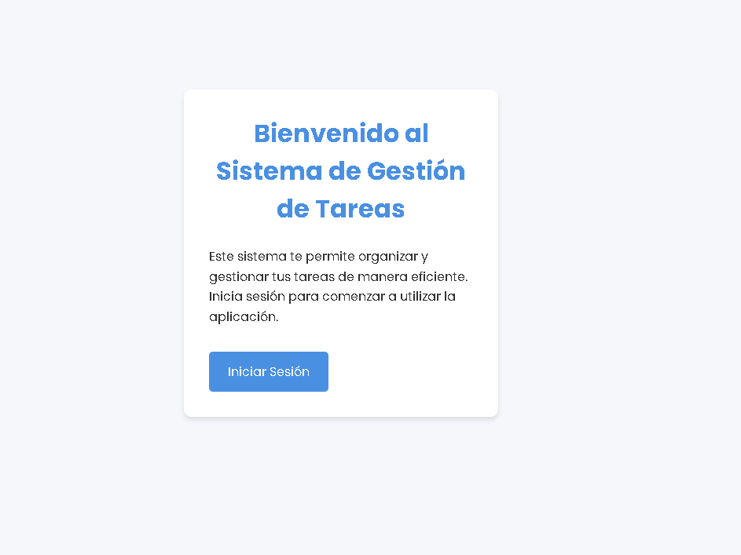

# Sistema de Gestión de Tareas

Este proyecto es una aplicación web de gestión de tareas que permite a los usuarios organizar y dar seguimiento a sus actividades diarias. Los usuarios pueden crear, editar, eliminar y marcar tareas como completadas, así como filtrarlas por prioridad y estado.

## Tecnologías Utilizadas

- PHP
- MySQL
- HTML5
- CSS3
- JavaScript (ES6+)
- Bootstrap 5
- XAMPP (como entorno de desarrollo local)

## Para que funcione

### Instalar XAMPP:

1. Descarga XAMPP desde [https://www.apachefriends.org/index.html](https://www.apachefriends.org/index.html)
2. Instala XAMPP siguiendo las instrucciones del instalador

### Iniciar el servidor:

1. Abre el panel de control de XAMPP
2. Inicia los módulos Apache y MySQL haciendo clic en "Start" junto a cada uno

### Colocar los archivos del proyecto:

1. Navega a la carpeta de instalación de XAMPP (usualmente C:\\xampp en Windows)
2. Dentro de esta carpeta, encuentra la subcarpeta "htdocs"
3. Crea una nueva carpeta llamada "task_management" dentro de "htdocs"
4. Copia todos los archivos del proyecto dentro de esta nueva carpeta

### Configurar la base de datos:

1. Abre tu navegador y ve a [http://localhost/phpmyadmin](http://localhost/phpmyadmin)
2. Crea una nueva base de datos llamada "task_management"
3. Importa el archivo SQL proporcionado con el proyecto (si existe)

### Acceder a la aplicación:

1. Abre tu navegador
2. En la barra de direcciones, escribe: [http://localhost/task_management/index.php](http://localhost/task_management/index.php)
3. Deberías ver la página de inicio de la aplicación

## Solución de problemas comunes:

- Si ves un error 404, verifica que los archivos estén en la carpeta correcta
- Si ves errores de PHP, asegúrate de que Apache y MySQL estén funcionando en XAMPP
- Si tienes problemas de conexión a la base de datos, revisa el archivo de configuración de la base de datos en el proyecto

### Nota

- Si quieres iniciar secion rapidamente utiliza este correo y contraseña
- Correo: daniel234@gmail.com
- Contraseña: 123456

## Capturas de pantalla

## Demostración

## Licencia

[MIT](https://choosealicense.com/licenses/mit/)
